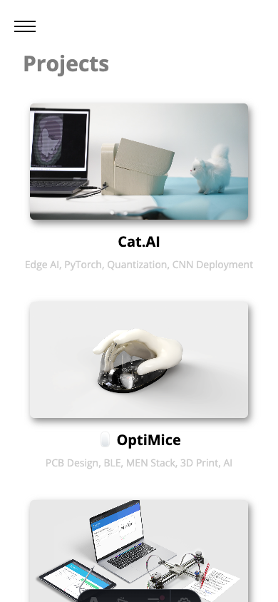
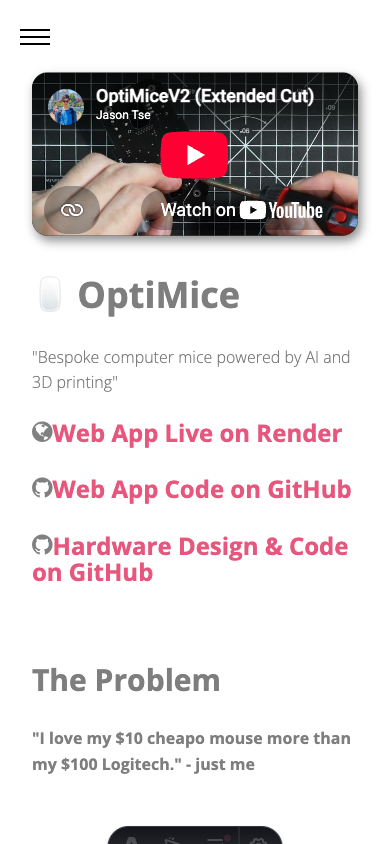
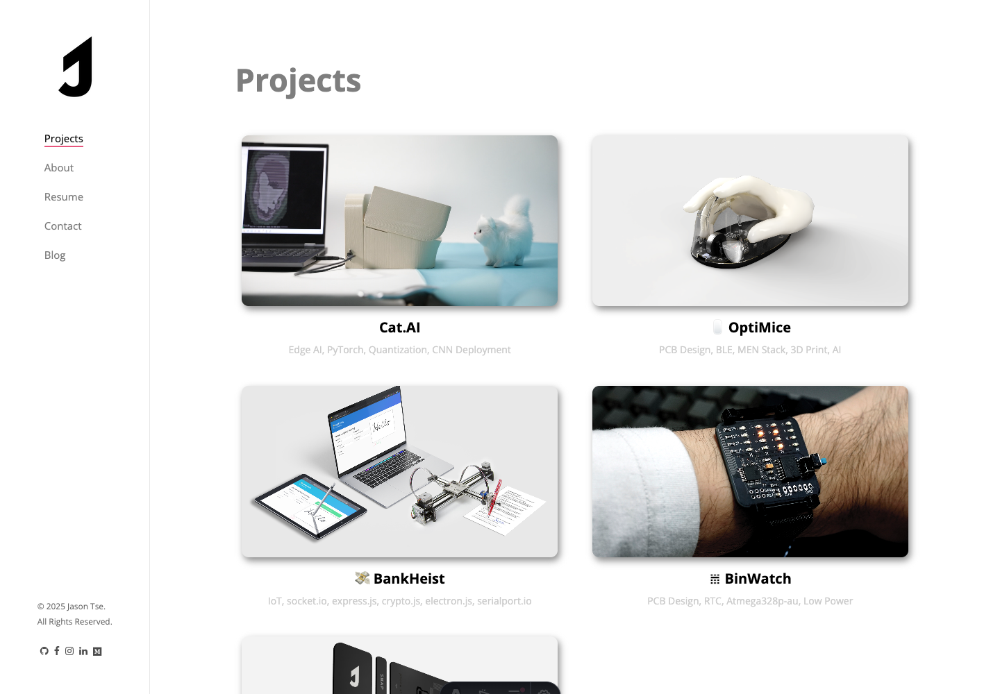
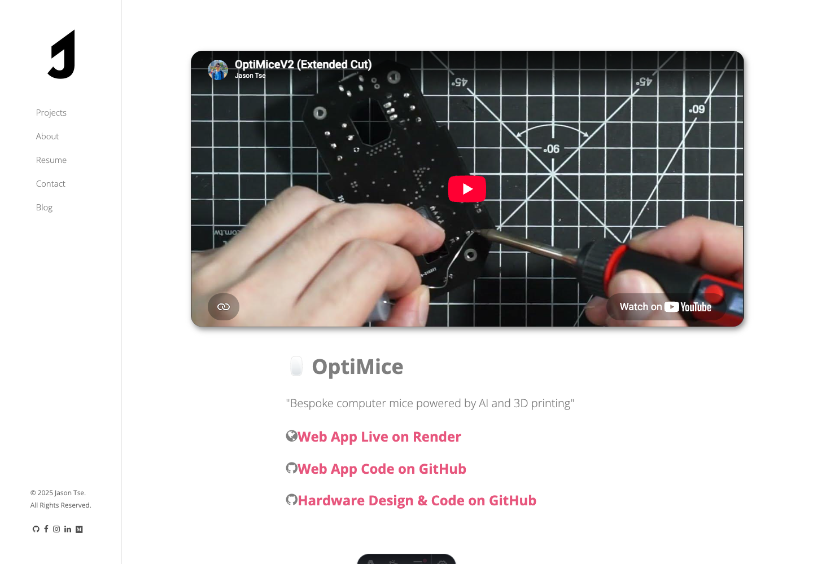

# JCR-112 mobile horizontal clipping verification

## Root cause

The responsive width rules were correct after layout settled, but the shared `fadeInLeft` entrance animation translated full-width Bootstrap rows and columns 50px to the left. Mobile screenshots could therefore capture project summaries and the OptiMice hero while they were outside the viewport.

The fix preserves the leftward entrance on viewports up to 768px while reducing its translation from 50px to 12px. The shared mobile row starts at `x=5` instead of crossing the viewport edge, then reaches its final `x=17` position. Desktop retains the original 50px `fadeInLeft` animation.

## Measurements

All coordinates are CSS pixels measured in headless Chrome.

| Route and sample | Before | After |
| --- | --- | --- |
| `/projects.html`, 390px forced entrance | Project grid could reach `x=-33–323` with the original 50px translation | Project grid animates from `x=5–361` to `x=17–373`; contained throughout |
| `/optimice.html`, 390px forced entrance | Shared hero column could reach `x=-33–323` with the original 50px translation | Shared hero column animates from `x=5–361` to `x=17–373`; contained throughout |
| Both routes, settled 390px layout | Document `clientWidth=390`, `scrollWidth=390` | Document `clientWidth=390`, `scrollWidth=390`; affected content `x=32–358` |
| Both routes, settled 1440px layout | Document `clientWidth=1440`, `scrollWidth=1440` | Document `clientWidth=1440`, `scrollWidth=1440`; desktop geometry unchanged |

The OptiMice Owl carousels intentionally position inactive slides outside their carousel viewport. They do not increase document or body scroll width and are unrelated to JCR-112.

## Screenshots

### Mobile, 390×844

### Desktop, 1440×1000

## Verification

- `npm run verify:ci`
  - Built 12 pages.
  - Passed canonical-source, static-inventory, parity, project-content, structured-detail, and internal-link checks.
  - Verified 502 internal references across 23 generated HTML files.
- Forced animation checks at 0ms, 250ms, 650ms, and 1100ms passed at 390px. Both representative shared rows retained `animationName=fadeInLeftMobile`, moved 12px from left to right, and remained inside the viewport with zero document overflow.
- Equivalent 1440px checks retained `animationName=fadeInLeft` and the original 50px translation.
- Settled geometry checks passed at 390px and 1440px with zero document-level horizontal overflow.
- Representative screenshots were inspected for clipping, alignment, and desktop regression.
